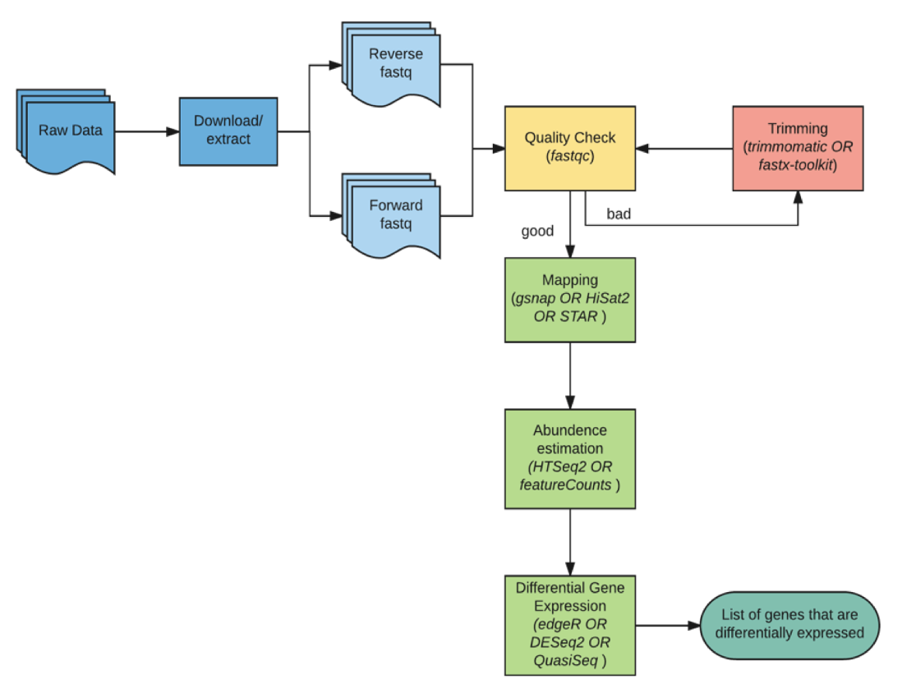
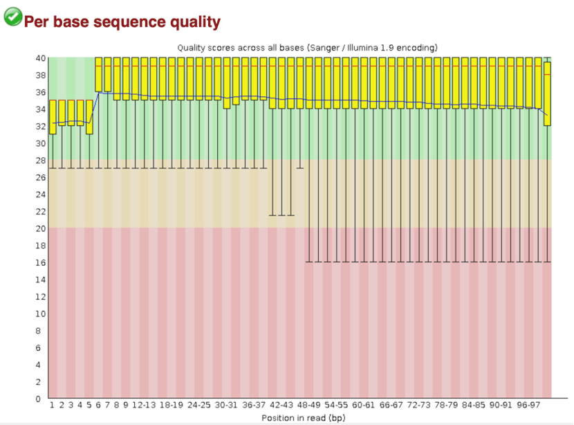
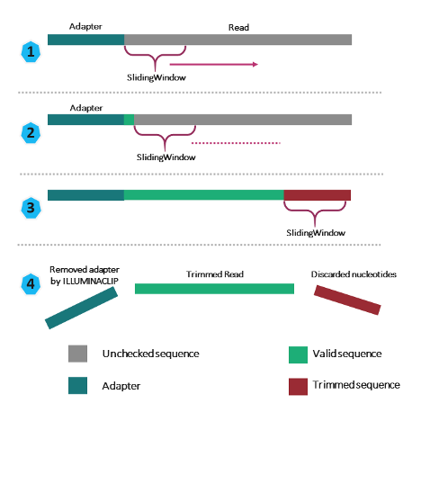
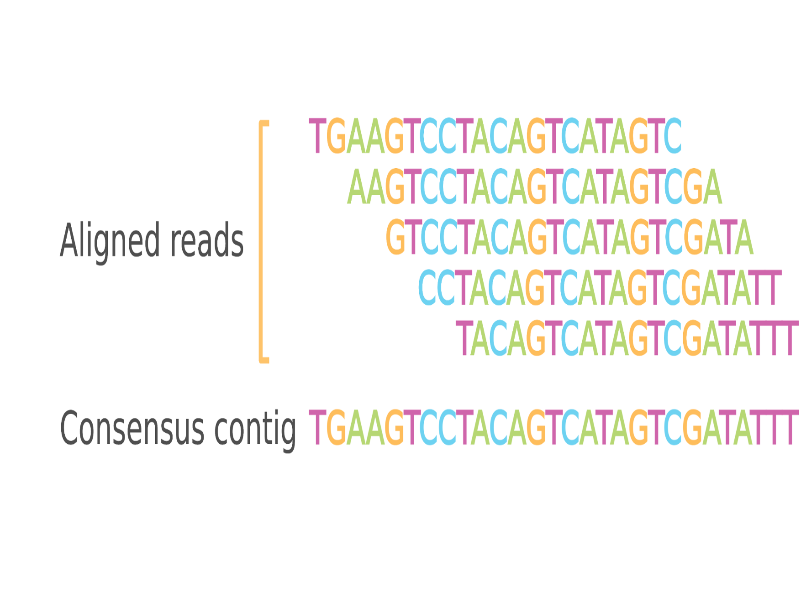
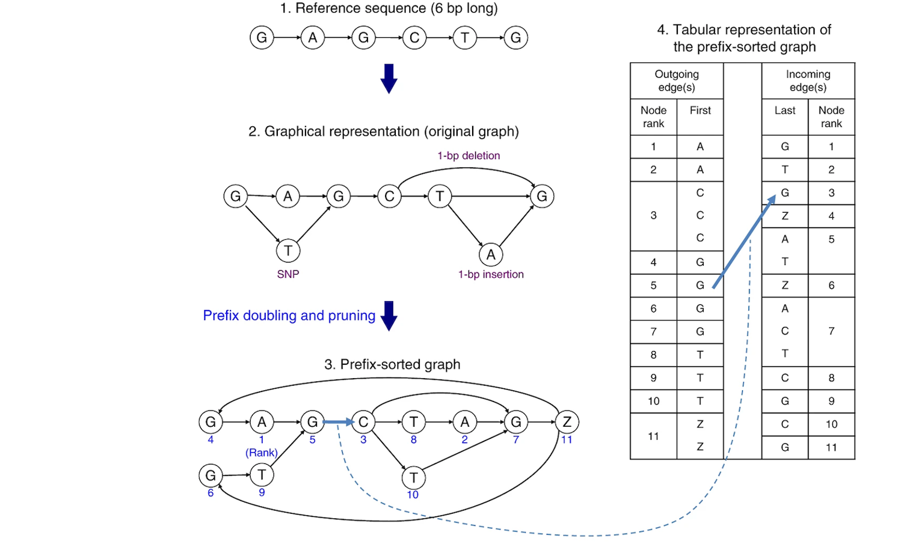
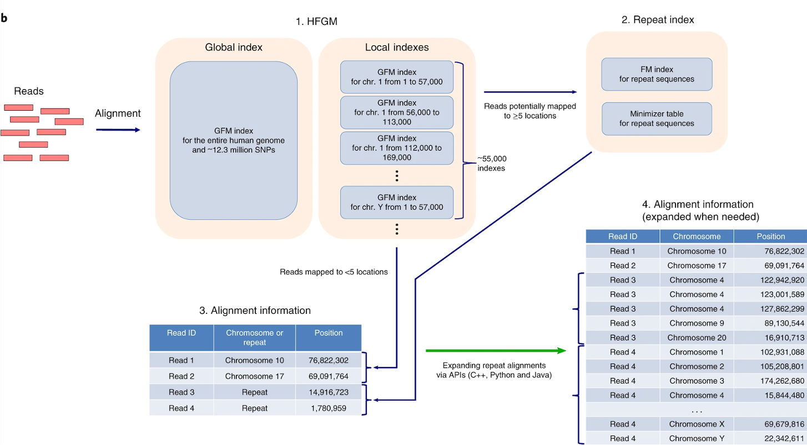
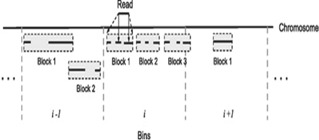

# RNA-seq-Pipeline

RNA sequencing is used to learn more about which genes are expressed (turned on) in different types of cells and when and how these genes are expressed.

  

## What is FASTQ format ?
The FASTQ files have 4 lines for each sequence :
1.	A sequence identifier with information about the sequencing run and the cluster. The exact contents of this line vary by based on the BCL to FASTQ conversion software used.
2.	The sequence (the base calls; A, C, T, G and N).
3.	A separator, which is simply a plus (+) sign.
4.	The base call quality scores. These are Phred +33 encoded, using ASCII characters to represent the numerical quality scores.

  

## STEP1 - QUALITY CHECK 

### Quality scores 
Sequencing quality scores measure the probability that a base is called incorrectly. Each base in a read is assigned a quality score by a phred-like algorithm.

The sequencing quality score of a given base, Q, is defined by the following equation:

  Q = -10log10(e)

where e is the estimated probability of the base call being wrong.
- Higher Q scores indicate a smaller probability of error.
- Lower Q scores can result in a significant portion of the reads being unusable. They may also lead to increased false-positive variant calls, resulting in inaccurate conclusions.

  

### FASTQC 
FastQC aims to provide a QC report which can spot problems which originate either in the sequencer or in the starting library material. It provides the basic statistics, per-base quality, adaptor content, per sequence GC content of each sequence. By examining parameters such as per-base quality scores and sequence GC content, FastQC enables us to identify sequences of high quality that are suitable for analysis. Utilizing high-quality sequences ensures that downstream analyses are based on reliable data, minimizing the risk of biased results and erroneous conclusions. Identifying and excluding low-quality sequences at this initial stage enhances the accuracy and robustness of the entire RNA-seq workflow.

  

_This view shows an overview of the range of quality values across all bases at each position in the FASTQ file._ 
_Blue line – Mean Quality, The central red line is the median value, The yellow box represents the inter-quartile range (25-75%), The upper and lower whiskers represent the 10% and 90% points_

- A warning will be issued if the lower quartile for any base is less than 10, or if the median for any base is less than 25. 
- This module will raise a failure if the lower quartile for any base is less than 5 or if the median for any base is less than 20. 

## STEP2 - TRIMMING
Trimming is a critical preprocessing step in RNA-seq analysis aimed at enhancing the quality of sequencing data. It involves the systematic removal of adaptor content, which can arise from sequencing artifacts or experimental procedures, thereby minimizing their potential interference with downstream analyses. Additionally, trimming targets bases with low quality, as indicated by their quality scores, ensuring that only high-quality bases are retained for further analysis.

  

**Sliding Window** refers to the number of base pairs examined for quality assessment at a time. In this process, if the average quality of these consecutive base pairs falls below the specified threshold, all base pairs within the window are removed from the sequence.

For example, in a sliding window of 4:15, the quality of four consecutive base pairs is evaluated together. If the average quality of these four base pairs is below 15, then all four base pairs are removed from the sequence.

## STEP3 - MAPPING

The mapping is the process of comparing each one of the reads with the reference genome.

  

### HISAT2

HISAT2 initiates by constructing a graph representation of the reference genome, incorporating variations such as mutations, insertions, and deletions. In this graph, nucleotides are represented as nodes, connected by edges indicating their relationships in the sequence. Nodes are then sorted alphabetically (e.g., adenosine 'A' being ranked as 1), and within each nucleotide, further ranked based on their position. This ranking facilitates the organization of incoming and outgoing edges for each node, which are compiled into a tabular format. This table streamlines computational processes by providing a structured view of the genome graph's connectivity, enhancing efficiency in alignment and variant detection.

  

To furthur enhance the speed and accuracy of the algorithm, HISAT2 creates a global heirarchial index representing the human genome and variants. Along with this they also contruct local index spanning 57kb of the reference genomes and variants. During the alignment process, HISAT2 first checks the local index for faster lookup of relevant regions. If the desired sequence is not found within this local index, HISAT2 then proceeds to consult the global hierarchical index, which represents the entire human genome and variants.

  

## STEP4 - ABUNDANCE ESTIMATION

Abundance estimation involves quantifying the expression levels of transcripts or genes within a biological sample, providing insights into the relative abundance of different RNA molecules.

### FeatureCounts
A two-level hierarchy is then created for each reference sequence. First, the reference sequence is divided into non-overlapping bins and features are assigned to bins according to their start positions. Within each bin, equal numbers of consecutive features are grouped into blocks. The number of blocks in a bin is the square root of the number of features in that bin (rounded up to the next whole number).

  

_Features (solid lines under the chromosome) are assigned to bins according to their start positions and grouped into blocks (gray boxes) within each bin. Query reads are compared with genomic bins, then with blocks (dashed arrows) and finally with features (solid arrows). The query read in the figure overlaps with two features in the first block of bin i_

Essentially, total read count associated with a gene (meta-feature) = the sum of reads associated with each of the exons (feature) that “belong” to that gene.

**Input for counting = multiple BAM files + 1 GTF file**

## REFERENCES
1. https://www.illumina.com/science/technology/next-generation-sequencing/plan-experiments/quality-scores.html
2. https://www.bioinformatics.babraham.ac.uk/projects/fastqc/
3. Bolger, A. M., Lohse, M., & Usadel, B. (2014). Trimmomatic: A flexible trimmer for Illumina Sequence Data. Bioinformatics, btu170 (https://academic.oup.com/bioinformatics/article/30/15/2114/2390096)
4. Kim, D., Paggi, J.M., Park, C. et al. Graph-based genome alignment and genotyping with HISAT2 and HISAT-genotype. Nat Biotechnol 37, 907–915 (2019).  (https://www.nature.com/articles/s41587-019-0201-4#citeas)
5. Liao Y, Smyth GK, Shi W. featureCounts: an efficient general purpose program for assigning sequence reads to genomic features. Bioinformatics. 2014 Apr 1;30(7):923-30. (https://pubmed.ncbi.nlm.nih.gov/24227677/)

 

